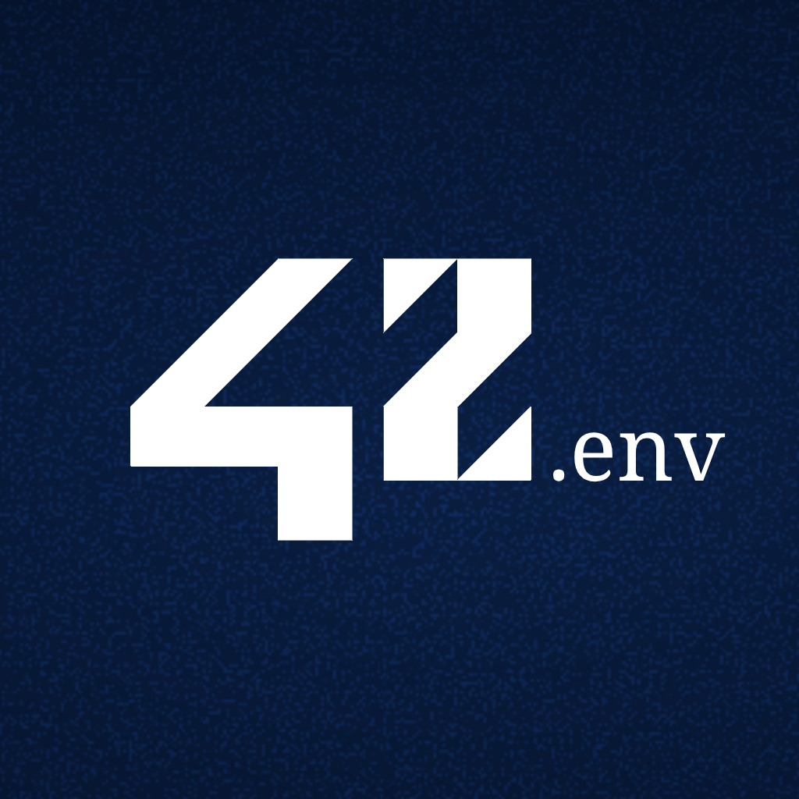

    

 

      

## À propos de 42-env

**42-env** est un projet contenant des environnements de travail préfaits utilisé sur la nouvelle infra **42next**.

## Fonctionnalités

- Logiciels et dépendances par défaut préinstallés
- Customisation et personnalisation
- Intégration de [norminette](https://github.com/42School/norminette)

## Installation

### Prérequis

> [!NOTE]
> Vous avez besoin d'un hyperviseur avant de continuer, je recommande personnellement **VMware Fusion** (sur Windows et macOS) ainsi que **qemu** (sur GNU/Linux et BSD). Pour **qemu** il est totalement possible d'utiliser [virt-manager](https://github.com/virt-manager/virt-manager) pour simplifier son utilisation.

- [VirtualBox](https://www.virtualbox.org/)
- [VMware](https://www.vmware.com/)
- [qemu](https://www.qemu.org/)

### Télécharger la machine virtuelle

> [!IMPORTANT]  
> Les étapes peuvent varier en fonction de l'hyperviseur. Un doute ? Read the doc.

Voici les trois releases pour les trois hyperviseurs cités ci-dessus :

- [Télécharger la release pour VirtualBox](#)
- [Télécharger la release pour VMware](#)
- [Télécharger la release pour qemu](#)

### Lancer la machine virtuelle

Lancez la machine virtuelle avec votre hyperviseur. Connectez-vous ensuite avec les identifiants suivants :

- `username`: standard
- `password`: password

Exécutez ensuite le script Shell qui se localise dans le dossier **Documents** (`/home/standard/Documents`), sélectionnez une langue puis suivez les instructions.

### Profiter

La machine virtuelle devrait être configurée. Vous pouvez l'utiliser pour vos révisions (pour recommencer la piscine par exemple).

> [!CAUTION]
> Ce projet n'a pas été distribué pour travailler en dehors de l'établissement ou enfreindre les règles de 42. Utilisez le projet avec sagesse et modération.

## Compléter votre expérience

Pour compléter votre expérience, voici quelques projets qui vous aideront et qui vaut le coup d'oeil.

- [42bash](https://github.com/SaikoroAsh/Bash42)
- [c_formatter_42](https://github.com/dawnbeen/c_formatter_42)

## Contribution

Veuillez consulter le [guide de contribution](https://github.com/enioaiello/enioaiello/blob/main/CONTRIBUTING.md) pour apprendre à contribuer.

## Soutiens

Si vous aimez ce projet, considérez à faire un don sur ma page [GitHub Sponsors](https://github.com/sponsors/enioaiello).

## Plus de projets

Plus de projets sont disponibles sur [mon GitHub](https://github.com/enioaiello) ou sur [mon portfolio](https://enioaiello.fr).

## Licence

Ce projet est distribué sous la licence MIT. Pour consulter cette licence, veuillez consulter le fichier [LICENSE](license).
